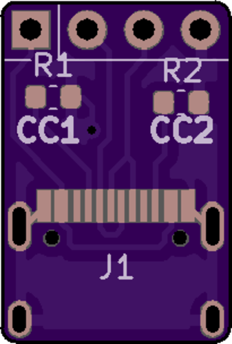

# USB_C_Breakout
Small, cheap USB Type C breakout boards for power only or USB 2.0 data installations

There are two different versions, one uses a harder to solder but low profile USB 3.0 port, the other uses an easier to solder but slightly taller USB 2.0 Type C port. Both adapters have the CC lines broken out so that resistors may be added (5.1k) so that the adapters will work properly on USB C hosts. 

## Low Profile Adapter:
Again, harder to solder but sometimes the low profile is needed. PCBs may need some filing to get the port to fit properly. Port needed is [E8124-010-01](https://www.arrow.com/en/products/e8124-010-01/pulse-electronics-corporation) though other Type C ports may fit as well. PCBs must be 0.8mm or thinner. 

## Easier to Solder Adapter:
Again, easier to solder but a little bit bigger. Port needed is [TYPE-C-31-M-12](https://lcsc.com/product-detail/USB-Type-C_Korean-Hroparts-Elec-TYPE-C-31-M-12_C165948.html). This is the same USB Type C port that the TP4056 modules use. PCB size should be 0.8mm or thinner but will still work fine on thicker PCBs. 

